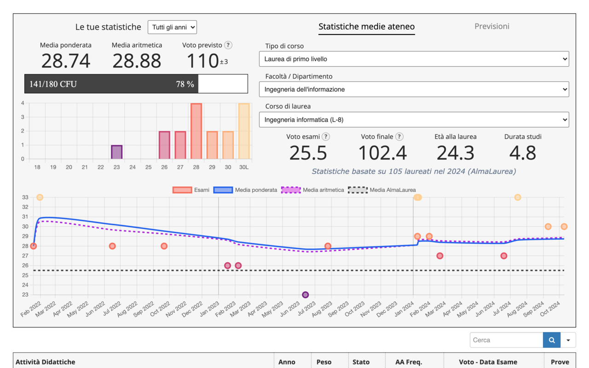

# `UniPi++`

### [Scaricala dal Chrome Web Store](https://chromewebstore.google.com/detail/unipi++/iblkplielknafpegjacgjbpgjgdcnkij)

Per qualsiasi problema, contattami su 

---

## `IT 🇮🇹`

_**UniPi++** è un'estensione NON UFFICIALE che NON è sviluppata e NON è affiliata in ALCUN modo con l'Università di Pisa_

> ### Panoramica

**UniPi++** è un'estensione Chrome che migliora il portale studenti dell'Università di Pisa aggiungendo statistiche e approfondimenti dettagliati sia sugli esami già sostenuti che su quelli futuri

> ### Funzionalità

i. **Dashboard**

Una dashboard mostra la media ponderata e aritmetica, il voto di laurea previsto, la distribuzione dei voti (istogramma) e un grafico di progressione dei voti (scatterplot) 

In particolare:

- Le metriche possono essere calcolate per anno accademico o sull'insieme di tutti gli esami

- Singoli esami possono essere esclusi tramite semplici checkbox

- Tutti i parametri di calcolo (e.g., il valore della lode, le esclusioni di CFU) ed anche alcune impostazioni visive (e.g., la mappa dei colori) possono essere completamente personalizzati tramite il menu dell'estensione (click sull'icona)

ii. **Confronto con le statistiche medie**

Un menu a tendina ti permette di confrontare le tue statistiche con i risultati medi di qualsiasi corso di laurea offerto dall'Università di Pisa

> I dati provengono da statistiche pubblicamente disponibili su [www.almalaurea.it](https://www.almalaurea.it)

iii. **Previsione esami**

Simula come cambierebbe la tua media a seconda dei voti che pensi di prendere nei prossimi esami

> Come viene previsto il voto di laurea? Tramite un modello di regressione quadratica addestrato sulla relazione "media degli esami" --> "media dei voti di laurea" considerando tutti i corsi di laurea offerti dall'Università di Pisa negli anni 2022, 2023 e 2024 

> ### Privacy

- L'estensione è attiva solo su https://www.studenti.unipi.it/auth/studente/Libretto. Non può fisicamente leggere dati da altri siti web
- L'estensione legge solo la tabella degli esami (nomi, voti e CFU) e nient'altro
- Tutti i dati vengono elaborati localmente sul computer dell’utente. Nulla viene mai trasmesso o memorizzato su server esterni

Q: Come faccio a sapere che quello scritto sopra è vero?
 
A: L'estensione è completamente open-source. Puoi ispezionare il codice sorgente <a href="src/">qui</a>

---

## `EN 🇬🇧`

_**UniPi++** is an UNOFFICIAL extension that is NOT developed by and NOT affiliated in ANY way with the "Università di Pisa"_

> ### Overview

**UniPi++** is a Chrome extension that enhances the University of Pisa student portal by adding detailed statistics and insights about both completed and future exams

> ### Features

i. **Comprehensive dashboard**

A visually pleasing dashboard that shows your weighted average, arithmetic average, predicted final grade, grade distribution chart (histogram) and grade progression chart (scatterplot)

- In particular:
    
    - Metrics can be calculated per academic year or across all exams
    
    - Individual exams can be excluded with simple checkboxes
    
    
    
    - All parameters (e.g., honors grade value, credit exclusions) and even visual settings (e.g., color map) can be fully customized via the extension’s popup menu
    
    

ii. **Metrics comparison**

A dropdown menu wich allows you to compare your metrics with the average results of any degree program offered by the University of Pisa

> The reference data comes from publicly available statistics on [www.almalaurea.it](https://www.almalaurea.it)

iii. **Exam forecast**

Simulate how your average would change depending on the grades of your upcoming exams

> How is the final grade predicted ? A quadratic regression model is applied, trained on the relationship between average exam grade and average final grade across all degree programs offered by the University of Pisa in the years 2022, 2023, and 2024 

> ### Privacy

- The extension is only active on https://www.studenti.unipi.it/auth/studente/Libretto. It can not physically read data from any other websites
- The extension only reads the exam table (exam names, grades and credits) and nothing else
- All data is processed locally on the user's computer. Nothing is ever transmitted to or stored on any external server

Q: How do i know that the above privacy facts are true?
 
A: The extension is fully open source. You can inspect the source code <a href="src/">here</a>
