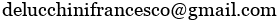
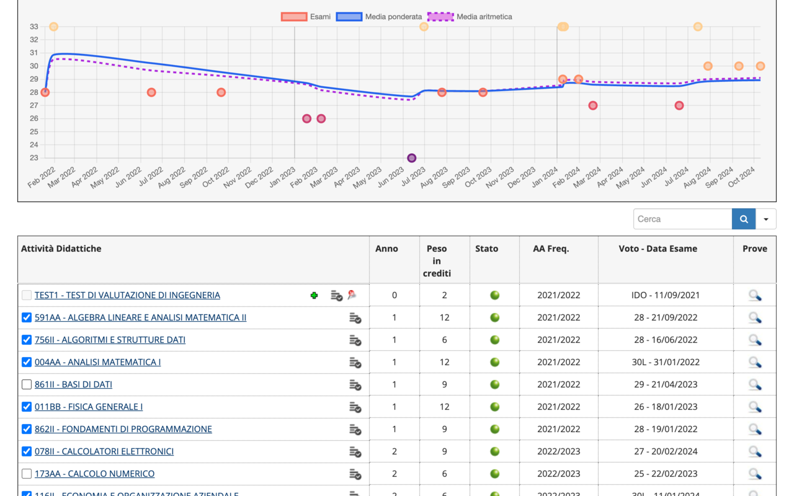

# `UniPi++`

> Il primo link (Chrome Web Store) funziona con qualsiasi browser basato su Chromium (e.g., Chrome, Brave, Edge, Opera)

Per qualsiasi problema, contattami su
 

---

_**UniPi++** è un'estensione NON UFFICIALE che NON è sviluppata e NON è affiliata in ALCUN modo con l'Università di Pisa_

> ### Panoramica

**UniPi++** è un'estensione che migliora il portale studenti dell'Università di Pisa aggiungendo statistiche e approfondimenti dettagliati sia sugli esami già sostenuti che su quelli futuri

> ### Funzionalità

i. **Dashboard**

Una dashboard mostra la media ponderata e aritmetica, il voto di laurea previsto, la distribuzione dei voti (istogramma) e un grafico di progressione dei voti (scatterplot) 

In particolare:

- Le metriche possono essere calcolate per anno accademico o sull'insieme di tutti gli esami

- Singoli esami possono essere esclusi tramite semplici checkbox

- Tutti i parametri di calcolo (e.g., il valore della lode, le esclusioni di CFU) ed anche alcune impostazioni visive (e.g., la mappa dei colori) possono essere completamente personalizzati tramite il menu dell'estensione (click sull'icona)

ii. **Confronto con le statistiche medie**

Un menu a tendina ti permette di confrontare le tue statistiche con i risultati medi di qualsiasi corso di laurea offerto dall'Università di Pisa

> I dati provengono da statistiche pubblicamente disponibili su [www.almalaurea.it](https://www.almalaurea.it)

iii. **Previsione esami**

Simula come cambierebbe la tua media a seconda dei voti che pensi di prendere nei prossimi esami

> Come viene previsto il voto di laurea? Tramite un modello di regressione quadratica addestrato sulla relazione "media degli esami" --> "media dei voti di laurea" considerando tutti i corsi di laurea offerti dall'Università di Pisa negli anni 2022, 2023 e 2024 

> ### Privacy

- L'estensione è attiva solo su https://www.studenti.unipi.it/auth/studente/Libretto. Non può fisicamente leggere dati da altri siti web
- L'estensione legge solo la tabella degli esami (nomi, voti e CFU) e nient'altro
- Tutti i dati vengono elaborati localmente sul computer dell’utente. Nulla viene mai trasmesso o memorizzato su server esterni

Q: Come faccio a sapere che quello scritto sopra è vero?
 
A: L'estensione è completamente open-source. Puoi ispezionare il codice sorgente <a href="src/">qui</a>
